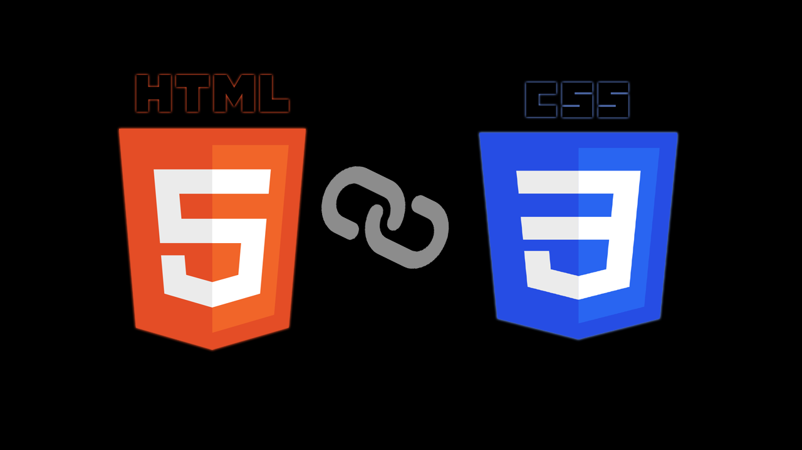
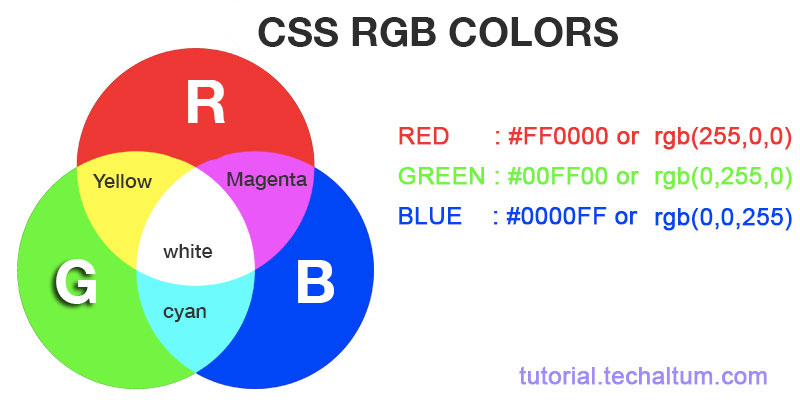
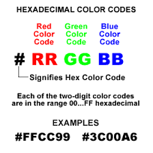
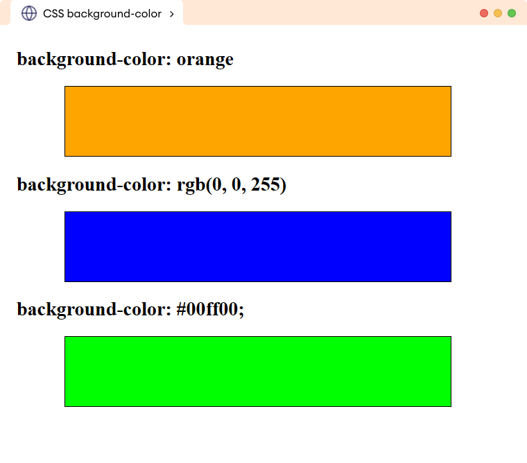
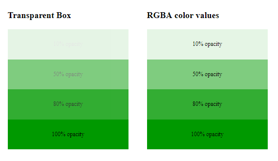
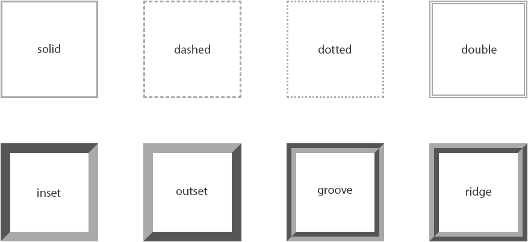
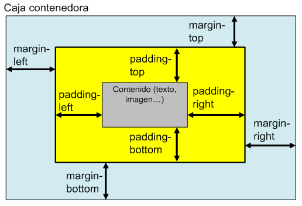
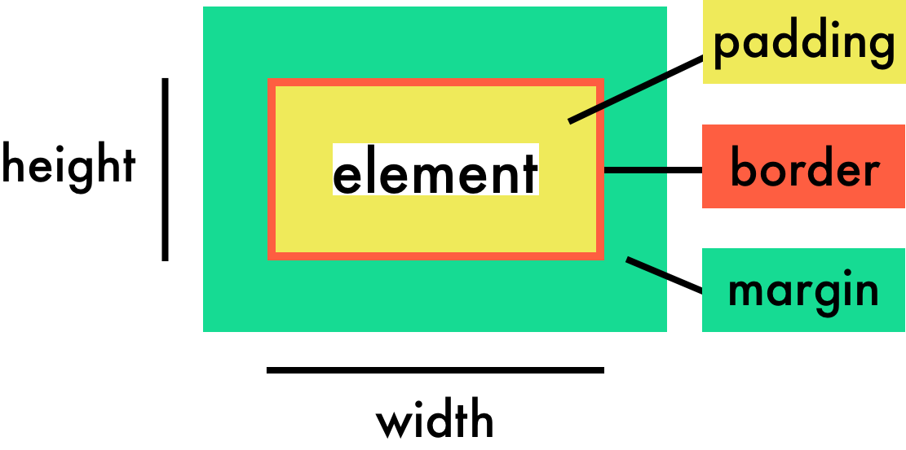
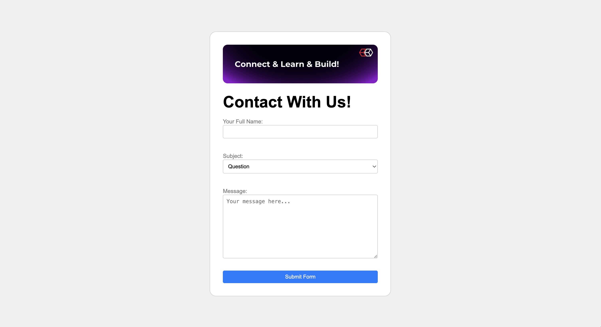

# **Week 2 / Workshop 3 / CSS Basics 1**

In this workshop, you will learn how to enhance the presentation of your HTML webpage using CSS. By the end of this workshop, you will understand the fundamentals of CSS and how to apply it to your web projects.

CSS (Cascading Style Sheets) is used to style and layout web pages. While HTML defines the structure of a webpage, CSS defines how it looks. You can use CSS to apply styles like colors, fonts, margins, padding, and more to your webpage elements.

## Step 1: Linking CSS to an HTML Document

There are **three main ways** to add CSS to an HTML document [https://www.w3schools.com/css/css_howto.asp]:

- **Inline Styles:** Applied directly to HTML elements using the `style` attribute.

  - Example:
    ```html
    <p style="color: red;">This is an example of inline styling style</p>
    ```

<br>
<br>

- **Internal Styles:** Placed within the `<style>` tag in the `<head>` section of your HTML document.

  - Example:
    ```html
    <head>
      <style>
        p {
          color: blue;
        }
      </style>
    </head>
    ```

<br>
<br>

- **External Styles:** Defined in an external CSS file and linked to your HTML document using the `<link>` tag in the `<head>` section.

  - Example:
    ```html
    <head>
      <link rel="stylesheet" href="styles.css" />
    </head>
    ```

## Step 2: Basic CSS Syntax

CSS is made up of selectors, properties, and values. [https://www.w3schools.com/css/css_syntax.asp]


- **Selectors** specify the HTML elements to which you want to apply styles (e.g., `p {}`, `.class {}`, `#id {}`). [https://www.w3schools.com/css/css_selectors.asp]

  - Example of defining a class selector:

    ` <h1 class="formHeader">Contact With Us!</h1>`

  - Example of defining an id selector:

    ` <h1 id="formHeader">Contact With Us!</h1>`

<br>
<br>

- **Properties** are the aspects of the elements you want to style (e.g., `color`, `font-size`, `margin`).

<br>
<br>

- **Values** define the specific style to apply (e.g., `red`, `16px`, `center`).

  - Example of basic CSS syntax:

    ```css
    selector {
      property: value;
    }
    ```

  - Example applied to an HTML document:

    ```css
    p {
      color: green;
      font-size: 20px;
    }
    ```

<br>
<br>

- **Comments** are used to explain the code, and may help when you edit the source code at a later date. [https://www.w3schools.com/css/css_comments.asp]

  - Example:
    ```css
    /* This is a single-line comment */
    p {
      color: red;
    }
    ```

## Step 3: Basic CSS Properties

Here are a few essential CSS properties you'll use to style your webpage:

- **1- Colors:** Colors are used to set the background, text, or borders of elements. 

  - 
  - 

  - Examples:

    ```css
    body {
      color: hsl(9, 100%, 64%);
      background-color: #ff6347;
    }

    h1 {
      color: darkblue;
      background-color: rgba(255, 99, 71, 0.5);
    }
    ```

  - You can set the color of backgrounds, texts, borders, and more.
  - Colors are specified using predefined color names (Tomato, Orange, Gray...), or RGB, HEX, HSL, RGBA, HSLA values.
  - Learn More:
    - https://www.w3schools.com/css/css_colors.asp 
    - http://web.simmons.edu/~grovesd/comm244/notes/week3/css-colors

<br>
<br>

- **2- Backgrounds:** The CSS background properties are used to add background effects for elements. 

  - 
  - Examples:

    ```css
    body {
      color: hsl(9, 100%, 64%);
      background-color: #ff6347;
    }

    h1 {
      color: darkblue;
      background-color: rgba(255, 99, 71, 0.5);
    }
    ```

  - We will use only `background-color` for now. Don't worry about other properties, we will learn and practice them in detail later on.
  - Learn More:
    - W3Schools Backgrounds: https://www.w3schools.com/css/css_background.asp

<br>
<br>

- **3- Opacity:** The `opacity` property specifies the opacity/transparency of an element. It can take a value from 0.0 - 1.0. The lower value, the more transparent. 

  - 

  - Example:

    ```css
    div {
      background-color: green;
      opacity: 0.3;
    }
    ```

  - We will use only `background-color` for now. Don't worry about other properties, we will learn and practice them in detail later on.
 - Learn More:
    - W3Schools Opacity: https://www.w3schools.com/css/css_background.asp

<br>
<br>

- **4- Borders:** Borders define the edge of an element, and can have different styles, thicknesses, and colors.

  - 

  - Examples:

    ```css
    div {
      border: 2px solid black;
      border-radius: 10px; /* Optional: For rounded corners */
    }

    img {
      border: 3px dashed red;
    }

    table {
      border: 1px solid #000;
      border-collapse: collapse;
    }

    td,
    th {
      border: 1px solid grey;
    }
    ```
  - Learn More:
    - W3Schools CSS Borders: https://www.w3schools.com/css/css_border.asp

<br>
<br>

- **5- Margins:** Margins create space outside of elements, affecting the spacing between elements.

  - 

  - Examples:

    ```css
    body {
      margin: 0; /* Removes default margins of the browser */
    }

    h1 {
      margin-top: 20px;
      margin-bottom: 10px;
      margin-left: 15px;
      margin-right: 15px;
    }

    p {
      margin: 10px 20px; /* 10px top and bottom, 20px left and right margin */
    }

    .myDiv {
      margin: 5px 10px 0px 15px; /* 5px top, 10px right, 0px bottom, 15px left margin */
    }
    ```
  - Learn More:
    - W3Schools CSS Margins: https://www.w3schools.com/css/css_margin.asp
<br>
<br>

- **6- Paddings:** Paddings add space inside an element, between the content and the border.

  - 

  - Examples:

    ```css
    div {
      padding: 20px; /* Adds padding inside the div */
    }

    button {
      padding: 10px 20px; /* 10px top and bottom, 20px left and right padding */
    }

    table {
      padding: 5px 10px 0px 15px; /* 5px top, 10px right, 0px bottom, 15px left padding. */
    }

    p {
      padding-top: 5px;
      padding-right: 10px;
      padding-bottom: 0px;
      padding-left: 15px;
    }
    ```
  - Learn More:
    - W3Schools CSS Paddings: https://www.w3schools.com/css/css_padding.asp

<br>
<br>

- **7- Width & Height:** The CSS `height` and `width` properties are used to set the height and width of an element. 
 
  - 
  
  - Examples:

    ```css
    div {
      height: 200px;
      width: 500px;
      background-color: powderblue;
    }

    .myform {
      height: 45%;
      width: 30%;
      background-color: aqua;
    }
    ```

  - We will be learning `max-height`, `max-width`, `min-height`, and `min-width` properties later on.

  - Learn More:
    - W3Schools CSS Dimensions: https://www.w3schools.com/css/css_dimension.asp

<br>
<br>

- **8- Border Radius:** The `border-radius` property is used to add rounded borders to an element.

  - Examples:

    ```css
    p {
      border: 2px solid red;
      border-radius: 5px;
    }
    ```

  - Learn More:
    - W3Schools CSS Dimensions: https://www.w3schools.com/css/css_border_rounded.asp

<br>
<br>

- **9- Box Model:** All HTML elements can be considered as boxes. In CSS, the term "box model" is used when talking about design and layout. The CSS box model is essentially a box that wraps around every HTML element. It consists of: content, padding, borders and margins. The following image illustrates the box model: []

  - 

    - Content: The content of the box, where text and images appear
    - Padding: Clears an area around the content. The padding is transparent
    - Border: A border that goes around the padding and content
    - Margin: Clears an area outside the border. The margin is transparent

  - Example:

        ```css
        div {
          width: 300px;
          border: 15px solid green;
          padding: 50px;
          margin: 20px;
        }
  - Learn More:
    - W3Schools CSS Box Model: https://www.w3schools.com/css/css_boxmodel.asp

    <br>
    <br>

## Step 4 (Activity): Styling Our Contact Form

In this step, we will apply what we've just learned by styling the Contact Form that we created in the last workshop.

### Step 4.1: How will we link our CSS code to the HTML page?

We will use External Styling method to link our CSS code to our HTML page. For this reason, we will create a seperate file called `start.css` and will link it to `start.html` file with using `<link>`tag in our `<head>`element as following:

```html
<head>
  <link rel="stylesheet" href="start.css" />
</head>
```

### Step 4.2: See the initial version

First, note that the initial version of our Contact Form has not any selector:

```html
<form>
  <h1>Contact With Us!</h1>
  <label for="fullNameInputField">Your Full Name:</label><br />
  <input type="text" id="fullNameInputField" />
  <br />
  <br />
  <label for="subjectSelectField">Subject:</label><br />
  <select id="subjectSelectField">
    <option value="question">Question</option>
    <option value="feedback">Feedback</option>
    <option value="support">Support</option>
  </select>
  <br /><br />
  <label for="message">Message:</label><br />
  <textarea
    id="message"
    cols="30"
    rows="10"
    placeholder="Your message here..."
  ></textarea>
  <br /><br />
  <button class="submitButton" type="submit">Submit Form</button>
</form>
```

Here's how it looks initially:


### Step 4.3: Let's start styling!

**0. Removing default browser styling:**

1. Go to `start.css` file
2. Add the following style to prevent default styling of the browser:

- ```css
  * {
    margin: 0;
    padding: 0;
    box-sizing: border-box;
  }

  body {
    font-family: "Arial", sans-serif; /* Change the default font */
    background-color: #f0f0f0;
  }
  ```

<br>
<br>

**1. Styling `<form>` tag:**

1.  Add `class="contactForm"` selector
2.  Go to `start.css` file
3.  Style:

- ```css
  .contactForm {
    width: 30%;
    margin-left: 35%;
    margin-top: 5rem;
    padding: 2rem;
    background-color: #fff;
    border-radius: 16px;
    border: 1px solid #ccc;
  }
  ```

<br><br>

**2. Styling `<h1>`tag:**

1.  Add `class="formHeader"` selector
2.  Go to `start.css` file
3.  Style:

- ```css
  .formHeader {
    font-size: 2.5rem;
    margin-bottom: 1rem;
  }
  ```
  <br><br>

**3. Styling all the `<label>`tags:**

1.  We will use `label` tag's itself as the selector.
2.  Go to `start.css` file
3.  Style:

- ```css
  label {
    font-size: 10px;
    color: gray;
  }
  ```
  <br><br>

**4. Styling Full Name `input` field and Subject `select` field:**

1. Use `id="fullNameInputField"` as the selector of Full Name input field (`<input />`)
2. Use `id="subjectSelectField"` selector to the Subject selection input field (`<select>`)
3. Go to `start.css` file
4. Style:

- ```css
  #fullNameInputField,
  #subjectSelectField {
    width: 100%;
    padding: 0.5rem;
    margin-bottom: 1rem;
    border: 1px solid #ccc;
    border-radius: 4px;
  }
  ```

  <br><br>

**5. Styling `<textarea>` message input field:**

1. Use `id="message"` as the selector of the message input field (`<textarea />`)
2. Go to `start.css` file
3. Style:

- ```css
  #message {
    width: 100%;
    padding: 0.5rem;
    margin-bottom: 0.5rem;
    border: 1px solid #ccc;
    border-radius: 4px;
    height: 10rem;
  }
  ```
  <br><br>

**6. Styling Submit button `<button>`:**

1. Use `class="submitButton"` as the selector of the submit button (`<button>`)
2. Go to `start.css` file
3. Style:

- ```css
  .submitButton {
    width: 100%;
    padding: 0.5rem;
    margin-bottom: 1rem;
    border: 1px solid #ccc;
    border-radius: 4px;
    height: 10rem;
  }
  ```
  <br><br>

**7. Adding and styling a form image:**

1. Add `"` on top of the `form` element as the first tag.
2. Use `class="contactFormImage"` as the selector
3. Go to `start.css` file
4. Style:

- ```css
  .contactFormImage {
    width: 100%;
    border-radius: 12px;
    margin-bottom: 20px;
  }
  ```
  <br><br>

### Step 4.4: The final look

Here's what we've built:



**🎉 Congratulations! You have successfully completed this week's activity!**
